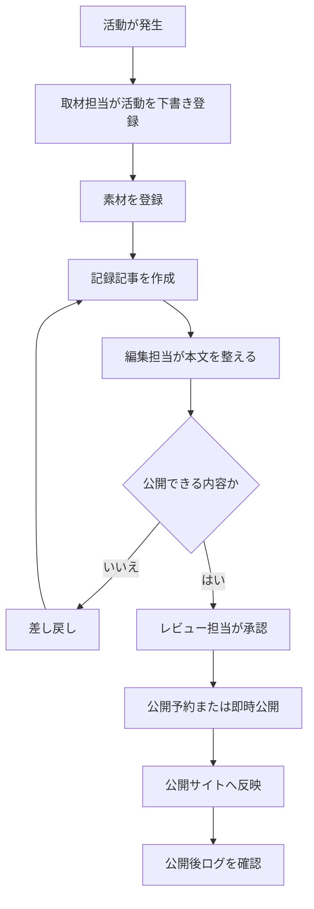
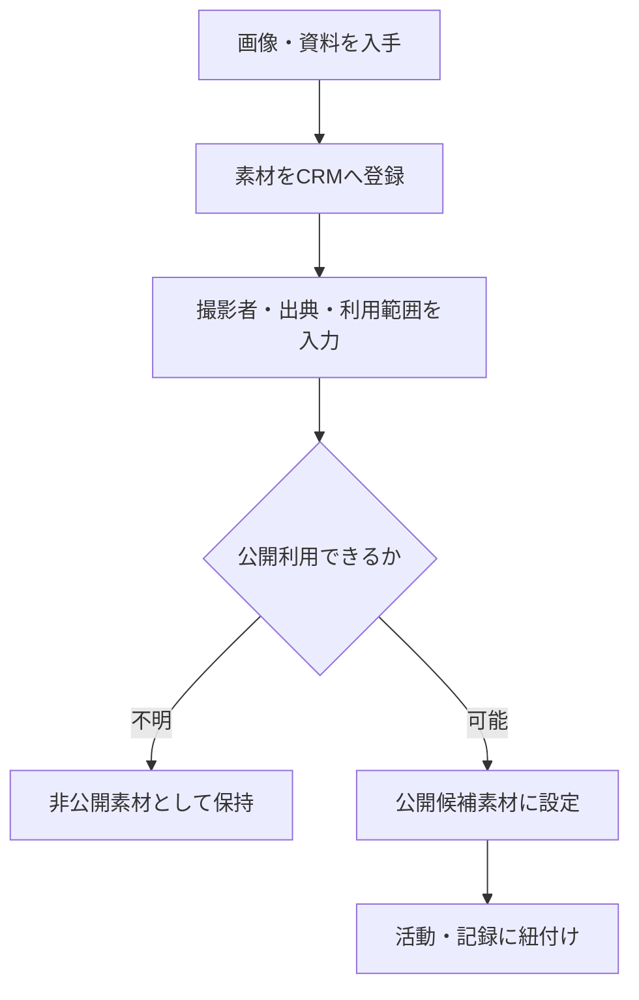
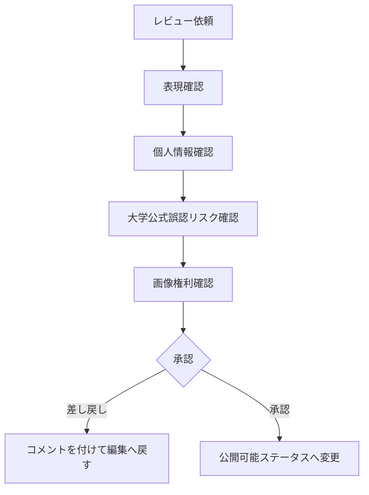
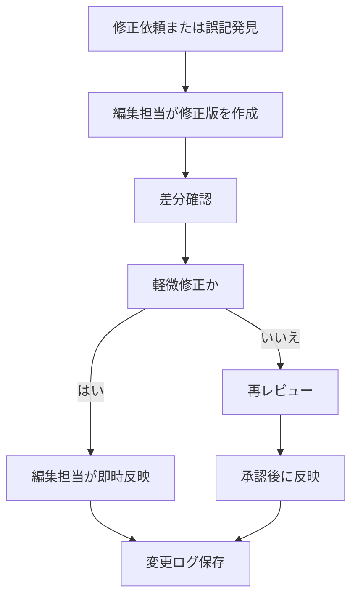

# 02. 業務フロー図

## 活動登録から公開まで

```mermaid
flowchart TD
  A[活動が発生] --> B[取材担当が活動を下書き登録]
  B --> C[素材を登録]
  C --> D[記録記事を作成]
  D --> E[編集担当が本文を整える]
  E --> F{公開できる内容か}
  F -- いいえ --> G[差し戻し]
  G --> D
  F -- はい --> H[レビュー担当が承認]
  H --> I[公開予約または即時公開]
  I --> J[公開サイトへ反映]
  J --> K[公開後ログを確認]
```

## 素材管理フロー

```mermaid
flowchart TD
  A[画像・資料を入手] --> B[素材をCRMへ登録]
  B --> C[撮影者・出典・利用範囲を入力]
  C --> D{公開利用できるか}
  D -- 不明 --> E[非公開素材として保持]
  D -- 可能 --> F[公開候補素材に設定]
  F --> G[活動・記録に紐付け]
```

## レビュー業務

```mermaid
flowchart TD
  A[レビュー依頼] --> B[表現確認]
  B --> C[個人情報確認]
  C --> D[大学公式誤認リスク確認]
  D --> E[画像権利確認]
  E --> F{承認}
  F -- 差し戻し --> G[コメントを付けて編集へ戻す]
  F -- 承認 --> H[公開可能ステータスへ変更]
```

## 公開後修正フロー

```mermaid
flowchart TD
  A[修正依頼または誤記発見] --> B[編集担当が修正版を作成]
  B --> C[差分確認]
  C --> D[軽微修正か]
  D -- はい --> E[編集担当が即時反映]
  D -- いいえ --> F[再レビュー]
  F --> G[承認後に反映]
  E --> H[変更ログ保存]
  G --> H
```
