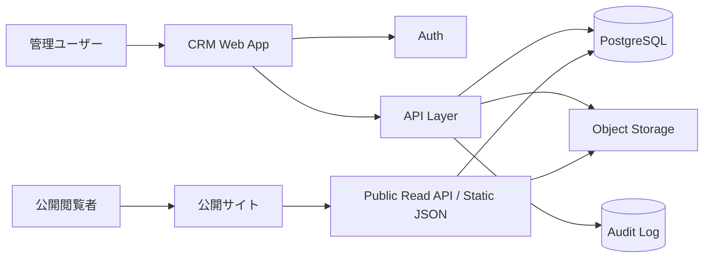
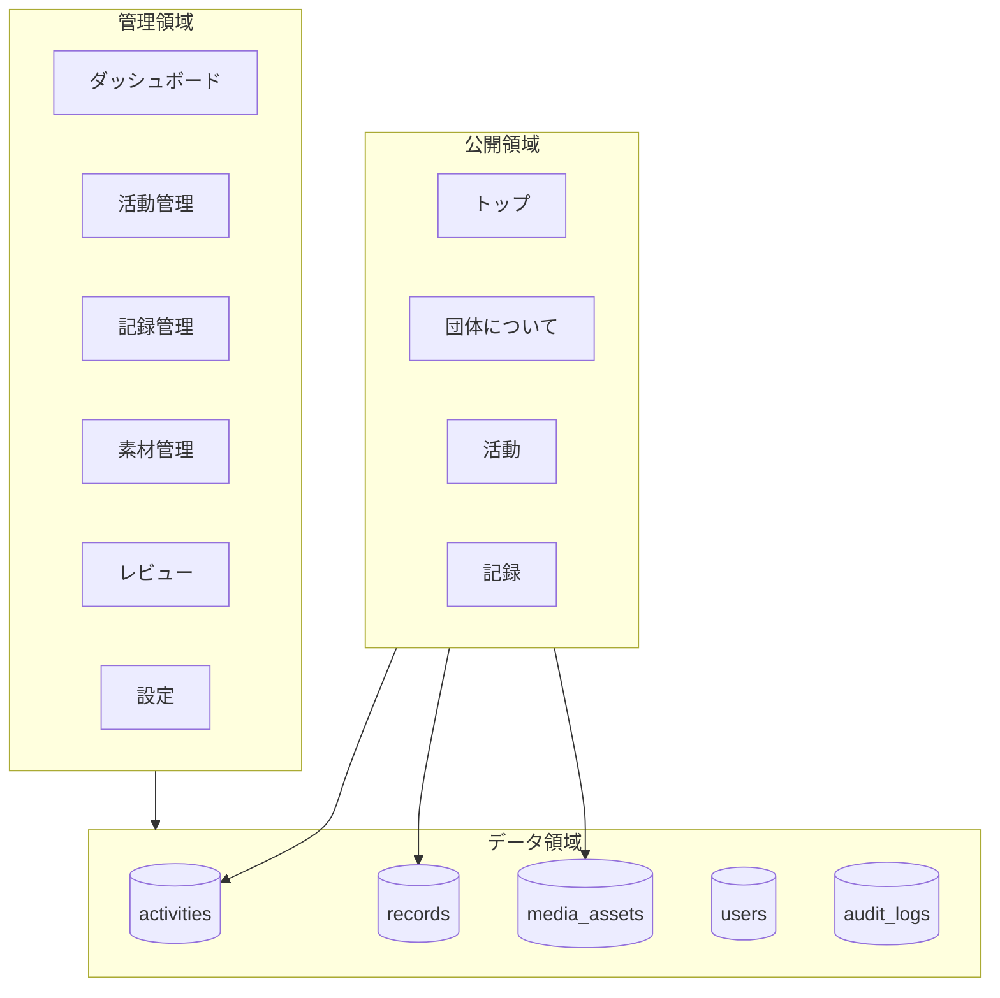

# 03. システム構成図

## 全体構成

## 推奨技術構成

| レイヤー | 推奨 | 理由 |
|---|---|---|
| 管理画面 | Next.js App Router | フォーム、認証、APIを同一プロジェクトで扱いやすい |
| 公開サイト | 既存静的サイト + 公開JSON/API | 表示を軽く保ち、営業感のない公式サイトにしやすい |
| DB | PostgreSQL | 活動、記録、素材、権限、ログの関係性を扱いやすい |
| 認証 | Supabase Auth or Google Workspace SSO | 小規模運営で導入しやすい |
| Storage | Supabase Storage / Cloudflare R2 | 画像、資料、サムネイルを管理 |
| Hosting | Vercel / Cloudflare Pages | 静的サイトと管理画面の分離が容易 |

## 論理構成

## 重要な分離

- 管理APIと公開APIを分ける
- 公開APIは `published` のみ返す
- 取材メモ、レビューコメント、内部メモは公開APIに含めない
- 素材は公開可能フラグと利用範囲を必須にする

## 代替案比較

| 観点 | 採用案: Next.js + PostgreSQL | 代替A: Headless CMS | 代替B: Google Sheets運用 |
|---|---|---|---|
| 初期速度 | 中 | 高 | 高 |
| 権限設計 | 高 | 中 | 低 |
| 公開承認 | 高 | 中 | 低 |
| 将来拡張 | 高 | 中 | 低 |
| 運用負荷 | 中 | 低 | 低 |
| セキュリティ統制 | 高 | 中 | 低 |

## 採用理由

活動・記録・素材・レビュー・ログを扱うため、単純CMSより関係データと権限管理が重要
Google Sheetsは初期運用には軽いが、公開承認と権限分離が弱いため中長期のCRMには不向き
