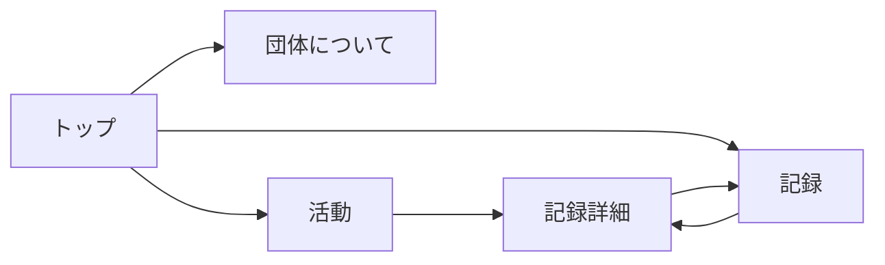
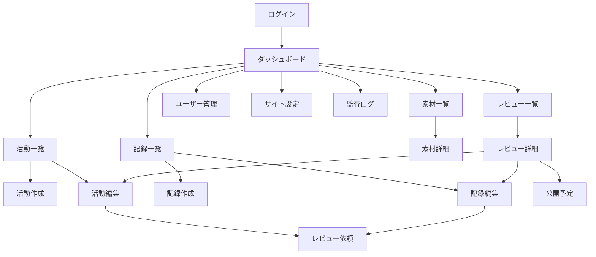
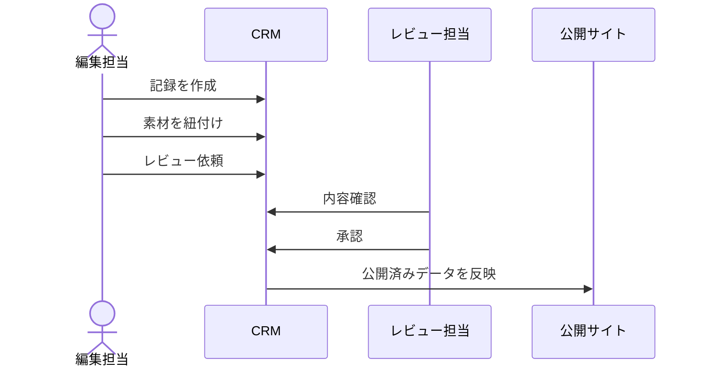

# 05. 画面遷移図

## 公開サイト

## 管理画面

## 主要導線

### 記録を公開する導線

## 遷移制約

- 未ログイン時に `/admin/*` へアクセスした場合は `/admin/login` へ遷移
- Contributorはレビュー承認画面へ入れない
- Reviewerはユーザー管理へ入れない
- Published状態の記事は直接編集せず、改訂版を作成して再承認する
- 公開サイトから管理画面へのリンクは出さない
