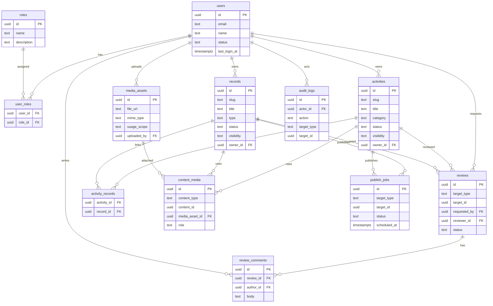

# 09. ER図

```mermaid
erDiagram
  users ||--o{ user_roles : has
  roles ||--o{ user_roles : assigned
  users ||--o{ activities : owns
  users ||--o{ records : owns
  users ||--o{ media_assets : uploads
  users ||--o{ reviews : requests
  users ||--o{ audit_logs : acts

  activities ||--o{ activity_records : links
  records ||--o{ activity_records : links

  activities ||--o{ content_media : uses
  records ||--o{ content_media : uses
  media_assets ||--o{ content_media : attached

  activities ||--o{ reviews : reviewed
  records ||--o{ reviews : reviewed
  reviews ||--o{ review_comments : has
  users ||--o{ review_comments : writes

  records ||--o{ publish_jobs : publishes
  activities ||--o{ publish_jobs : publishes

  users {
    uuid id PK
    text email
    text name
    text status
    timestamptz last_login_at
  }

  roles {
    uuid id PK
    text name
    text description
  }

  user_roles {
    uuid user_id FK
    uuid role_id FK
  }

  activities {
    uuid id PK
    text slug
    text title
    text category
    text status
    text visibility
    uuid owner_id FK
  }

  records {
    uuid id PK
    text slug
    text title
    text type
    text status
    text visibility
    uuid owner_id FK
  }

  media_assets {
    uuid id PK
    text file_url
    text mime_type
    text usage_scope
    uuid uploaded_by FK
  }

  activity_records {
    uuid activity_id FK
    uuid record_id FK
  }

  content_media {
    uuid id PK
    text content_type
    uuid content_id
    uuid media_asset_id FK
    text role
  }

  reviews {
    uuid id PK
    text target_type
    uuid target_id
    uuid requested_by FK
    uuid reviewer_id FK
    text status
  }

  review_comments {
    uuid id PK
    uuid review_id FK
    uuid author_id FK
    text body
  }

  publish_jobs {
    uuid id PK
    text target_type
    uuid target_id
    text status
    timestamptz scheduled_at
  }

  audit_logs {
    uuid id PK
    uuid actor_id FK
    text action
    text target_type
    uuid target_id
  }
```

## 関係の補足

- 活動は複数の記録を持てる
- 記録は複数の活動に紐付けできる
- 素材は活動・記録の両方に紐付けできる
- レビュー対象は活動または記録
- 公開処理は `publish_jobs` に履歴として残す
