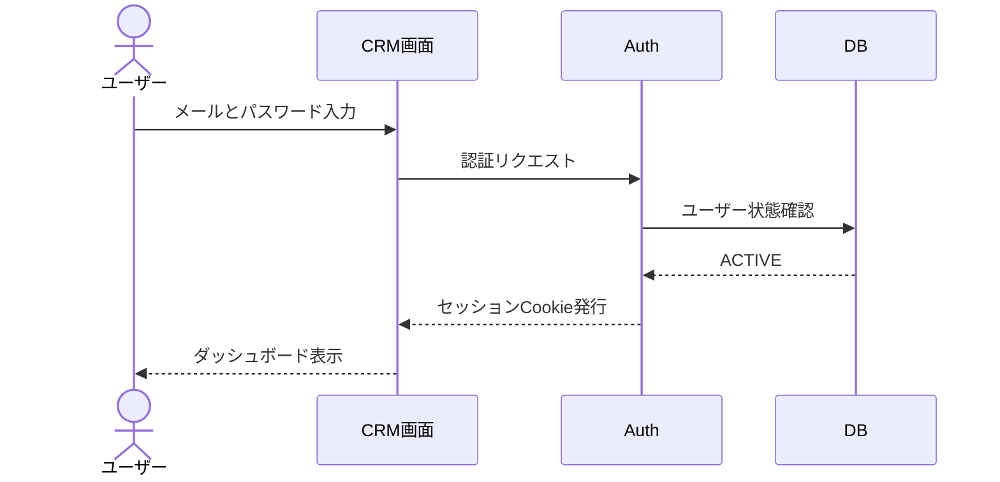
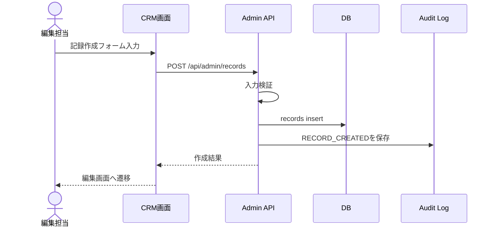
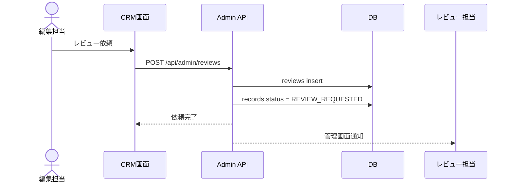
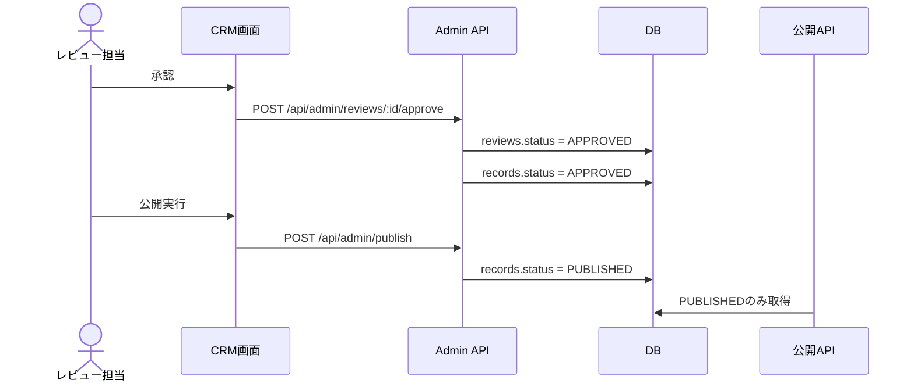
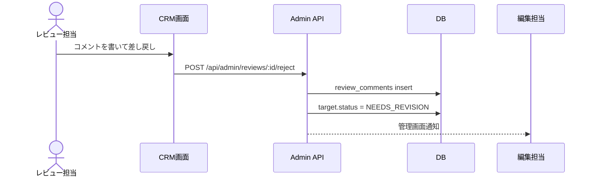
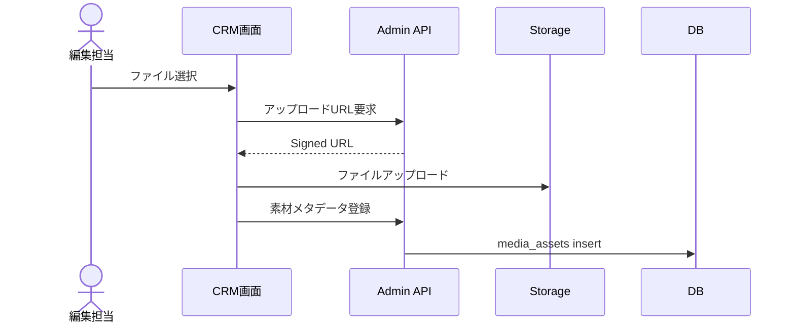

# 11. シーケンス図

## ログイン

```mermaid
sequenceDiagram
  actor User as ユーザー
  participant Web as CRM画面
  participant Auth as Auth
  participant DB as DB

  User->>Web: メールとパスワード入力
  Web->>Auth: 認証リクエスト
  Auth->>DB: ユーザー状態確認
  DB-->>Auth: ACTIVE
  Auth-->>Web: セッションCookie発行
  Web-->>User: ダッシュボード表示
```

## 記録作成

```mermaid
sequenceDiagram
  actor Editor as 編集担当
  participant Web as CRM画面
  participant API as Admin API
  participant DB as DB
  participant Log as Audit Log

  Editor->>Web: 記録作成フォーム入力
  Web->>API: POST /api/admin/records
  API->>API: 入力検証
  API->>DB: records insert
  API->>Log: RECORD_CREATEDを保存
  API-->>Web: 作成結果
  Web-->>Editor: 編集画面へ遷移
```

## レビュー依頼

```mermaid
sequenceDiagram
  actor Editor as 編集担当
  participant Web as CRM画面
  participant API as Admin API
  participant DB as DB
  participant Reviewer as レビュー担当

  Editor->>Web: レビュー依頼
  Web->>API: POST /api/admin/reviews
  API->>DB: reviews insert
  API->>DB: records.status = REVIEW_REQUESTED
  API-->>Web: 依頼完了
  API-->>Reviewer: 管理画面通知
```

## 承認と公開

```mermaid
sequenceDiagram
  actor Reviewer as レビュー担当
  participant Web as CRM画面
  participant API as Admin API
  participant DB as DB
  participant Site as 公開API

  Reviewer->>Web: 承認
  Web->>API: POST /api/admin/reviews/:id/approve
  API->>DB: reviews.status = APPROVED
  API->>DB: records.status = APPROVED
  Reviewer->>Web: 公開実行
  Web->>API: POST /api/admin/publish
  API->>DB: records.status = PUBLISHED
  Site->>DB: PUBLISHEDのみ取得
```

## 差し戻し

```mermaid
sequenceDiagram
  actor Reviewer as レビュー担当
  participant Web as CRM画面
  participant API as Admin API
  participant DB as DB
  participant Editor as 編集担当

  Reviewer->>Web: コメントを書いて差し戻し
  Web->>API: POST /api/admin/reviews/:id/reject
  API->>DB: review_comments insert
  API->>DB: target.status = NEEDS_REVISION
  API-->>Editor: 管理画面通知
```

## 素材アップロード

```mermaid
sequenceDiagram
  actor User as 編集担当
  participant Web as CRM画面
  participant API as Admin API
  participant Storage as Storage
  participant DB as DB

  User->>Web: ファイル選択
  Web->>API: アップロードURL要求
  API-->>Web: Signed URL
  Web->>Storage: ファイルアップロード
  Web->>API: 素材メタデータ登録
  API->>DB: media_assets insert
```
