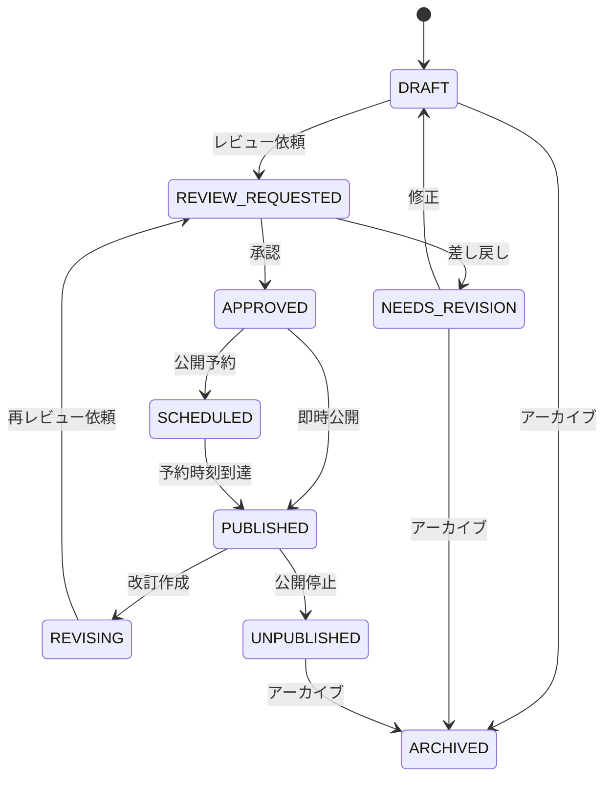
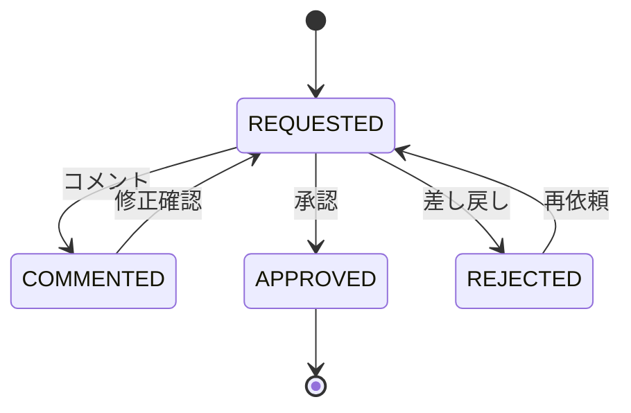
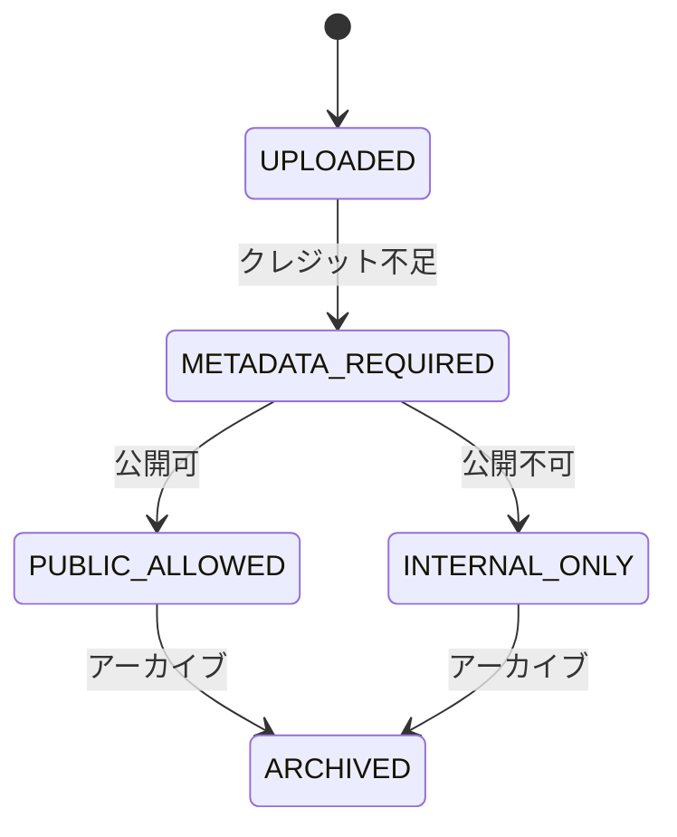

# 13. 状態遷移図

## コンテンツ状態

## 状態一覧

| 状態 | 説明 | 公開API |
|---|---|---|
| DRAFT | 下書き | 出ない |
| REVIEW_REQUESTED | レビュー依頼中 | 出ない |
| NEEDS_REVISION | 差し戻し | 出ない |
| APPROVED | 承認済み | 出ない |
| SCHEDULED | 公開予約 | 予約時刻まで出ない |
| PUBLISHED | 公開済み | 出る |
| REVISING | 改訂中 | 現公開版のみ出る |
| UNPUBLISHED | 公開停止 | 出ない |
| ARCHIVED | アーカイブ | 出ない |

## レビュー状態

## 素材状態

## 遷移制約

- `PUBLISHED` へ遷移できるのはReviewer以上
- `PUBLISHED` の本文直接更新は禁止
- 公開済み修正は改訂版を作って再承認する
- `ARCHIVED` から復元する場合はAdminのみ
