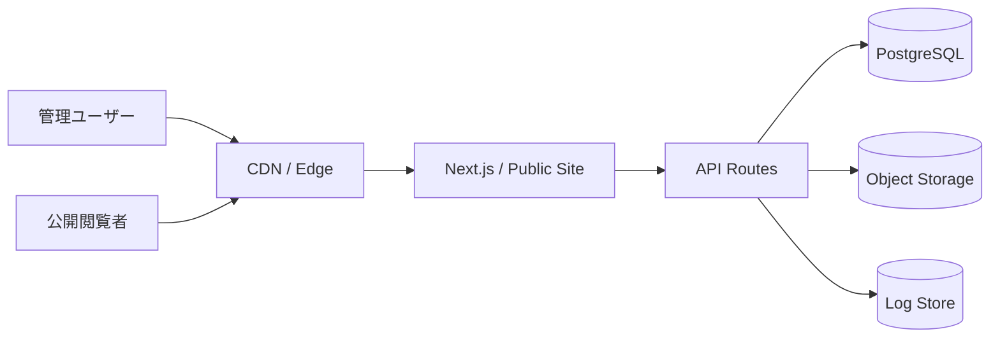

# 16. インフラ設計書

## 推奨構成

## 環境

| 環境 | 用途 |
|---|---|
| local | 開発 |
| preview | PR・レビュー |
| staging | 本番相当確認 |
| production | 本番 |

## ホスティング

| 領域 | 推奨 |
|---|---|
| 公開サイト | Vercel or Cloudflare Pages |
| CRM | Vercel |
| DB | Supabase Postgres / Neon / RDS |
| Storage | Supabase Storage / Cloudflare R2 |
| Logs | Platform logs + DB audit_logs |

## デプロイ

- mainブランチへのマージでproductionデプロイ
- PRごとにpreview環境作成
- DB migrationはCIでdry-run後に適用
- migration失敗時はアプリデプロイを止める

## 環境変数

| 名前 | 用途 |
|---|---|
| DATABASE_URL | DB接続 |
| AUTH_SECRET | セッション署名 |
| STORAGE_ENDPOINT | Storage接続先 |
| STORAGE_ACCESS_KEY | Storageキー |
| STORAGE_SECRET_KEY | Storageシークレット |
| ALLOWED_ORIGINS | CORS許可 |
| PUBLIC_SITE_URL | 公開サイトURL |

## バックアップ

- DBは日次バックアップ
- 重要リリース前に手動スナップショット
- Storageはバージョニングまたは削除保護を有効化
- 監査ログは3年保持

## 監視

- APIエラー率
- レイテンシ
- DB接続数
- Storageアップロード失敗
- 認証失敗回数
- 公開ジョブ失敗

## スケーリング

- 初期はサーバーレス構成
- DB接続はプーリング必須
- 一覧APIはページネーション必須
- 画像はCDN配信

## 障害時

| 障害 | 対応 |
|---|---|
| CRM停止 | 公開サイトは閲覧継続 |
| DB停止 | 管理・公開API停止、静的キャッシュがあれば公開継続 |
| Storage停止 | 新規アップロード停止、既存CDNキャッシュは閲覧可能 |
| 公開ジョブ失敗 | publish_jobsで失敗状態を記録し再実行 |
