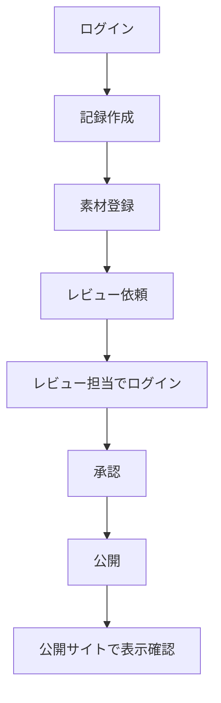

# 19. テスト設計書

## テスト方針

- 権限、公開承認、公開APIのテストを最優先
- 入力検証はAPI単体テストで担保
- 主要業務フローはE2Eで確認
- 公開サイトは表示崩れと公開データ制御を確認

## テストレベル

| レベル | 対象 | ツール例 |
|---|---|---|
| Unit | バリデーション、状態遷移、権限判定 | Vitest |
| Integration | API、DB、Storage | Vitest + Test DB |
| E2E | ログイン、作成、承認、公開 | Playwright |
| Visual | 公開サイト、管理画面主要ページ | Playwright screenshot |
| Security | 認証、認可、XSS、CSRF | 手動 + 自動 |

## 主要テストケース

### 認証

- 未ログインで管理画面に入れない
- 無効化ユーザーはログインできない
- セッション期限切れ時にログインへ戻る

### 権限

- Contributorは承認できない
- Editorは公開できない
- Reviewerはユーザー管理を開けない
- Adminは権限変更できる

### 活動管理

- 活動を作成できる
- 必須項目不足で保存できない
- slug重複でエラーになる
- 自分の下書きを編集できる

### 記録管理

- 記録を作成できる
- 関連活動を紐付けできる
- 未公開素材を公開記録へ使うと警告される
- 公開済み記録は直接編集できない

### レビュー

- レビュー依頼できる
- コメントを残せる
- 差し戻しできる
- 承認できる
- 承認後に公開可能になる

### 公開API

- PUBLISHEDのみ返す
- DRAFTは返さない
- INTERNAL素材は返さない
- ページネーションが効く

### セキュリティ

- XSS文字列が表示時に実行されない
- APIに未認証でアクセスできない
- 権限なし更新は403
- 監査ログに秘密情報が出ない

## E2Eシナリオ

## 受け入れ条件

- 主要E2Eが全て通る
- 公開APIが下書きを返さない
- Reviewer未満が公開できない
- 監査ログが作成・承認・公開で残る
- 公開サイトの主要画面で表示崩れがない
